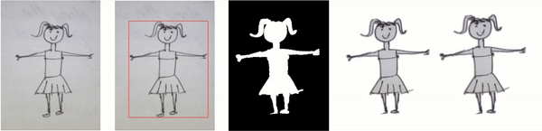

# Drawing Segmentation with CNN
This repo is the programming assignment for **COMP2211: Exploring Artificial Intelligence** taught by [Dr. Desmond Tsoi](https://www.cse.ust.hk/~desmond/) and [Dr. Pearl Xiao](https://huiruxiao.github.io/) at the Hong Kong University of Science and Technology. Most students are Year 1 undergraduate students. I designed the entire assignment.

- Solution [](https://colab.research.google.com/drive/1dZ_U6PHbpGhaQwtvh-VyUcV8KxfIkZFz?usp=sharing)
- Original Assignment [](https://drive.google.com/file/d/1Far4ljNXZfqIU-vH5zxW9HKcRhpEjtmA/view?usp=sharing
)
- A copy of the course website: [[Link]](https://shellywhen.github.io/CNN-drawing-segmentation/)
- Dataset: [[Google Drive]](https://drive.google.com/drive/folders/1Sm8F1y7Fuh_pEJhKDnUTxv2H3vQK8jGM?usp=sharing)

> *Amateur drawing is a delight, where imaginations take flight.*
*In every stroke and every line, lively charm so truly divine.*
*With pixels' dance and CNN' might, creations leap to wondrous heights.*
*From doodles raw to scenes that shine, tech weaves in motion, line by line.*

Object detection is a standard task in computer vision. The goal is to identify regions of interest from an input image. In our case, we are going to extract the bounding box for the character (2nd subfigure from left to right). A bounding box is the smallest rectangle region that wraps the object of interest. With the bounding box, it will be easy to segment the character from the image, and then facilitate the downstream animation generation tasks.



Image modified from Meta's [Animated Drawings](https://github.com/facebookresearch/AnimatedDrawings).

We are using the [*Amateur Drawings Dataset*](https://github.com/facebookresearch/AnimatedDrawings?tab=readme-ov-file#amateur-drawings-dataset). The original dataset comprises over 178K (~50Gb) images and associated annotations of amateur drawings. Due to the limit of Google Colab, the TAs have prepared a smaller sample.

The filtered dataset has 2K (~500Mb) amateur drawing images. And the JSON file records the annotation list. Each entry has the src field about the relative path to the image, and the bbox field is defined by [x, y, width, height], where x and y is the horizontal and vertical position of the top left corner.

```json
{
    "src": "images/1.png",
    "bbox": [
        32.0,
        56.888888888888886,
        303.36507936507934,
        428.69841269841265
    ]
}
```

To implement the CNN model, we will utilize the `Tensorflow` and `Keras` packages. They are well-suited for individuals new to machine learning. For detailed information, please consult the official [documentation](https://www.tensorflow.org/api_docs/python/tf) or refer to an [example](https://www.tensorflow.org/hub/tutorials/object_detection).

We will also take advantage of a pre-trained model (a machine learning model that has been trained on a large dataset to perform specific tasks) -- the well-known ResNet. Using a pretrained model instead of training one from scratch is like having a seasoned chef prepare the base of your dish, rather than starting to cook without any prior kitchen experience. It has encapsulated rich knowledge from a general dataset of natural images in its parameters. We will use our unique dataset to combat its limited understanding of children's amateur drawings. To achieve this, we need to modify the model architecture to fit in our object detection task, while freezing its weights.

In this programming assignment, we will follow three procedures.

- Data loading
  - Load the dataset
  - Transform the data to fit in the model
     - **Task 1**: <u>normalize the bounding box feature</u> (graded for accuracy)
  - Split the data into training and testing dataset
     - **Task 2**: <u>split the dataset</u> (graded for accuracy)
- Model compilation & training
  - Build the object detection model based on ResNet
     - **Task 3**: <u>add the convolution layer</u> (graded for accuracy)
     - **Task 4**: <u>add the output layer</u> (graded for accuracy)
     - **Task 5**: <u>define the mean square loss function</u> (graded for accuracy)
     - **Task 6**: <u>define the GIoU loss function</u> (graded for accuracy)
  - Train the model
     - **Task 7**: <u>export trained parameters for plagiarism check</u>
- Performance evaluation
  - Examine model performance
     - **Task 8**: <u>compute loss and provide the poorest sample</u> (graded for accuracy)
  - Admire our powerful object detector 😎
     - **Task 9**: <u>use the model for new images</u> (graded for accuracy)
     - **Task 10**: <u>test out the model</u> (graded for performance)

After finishing all tasks, you should have four files for testing and grading: `proof.pkl`, `grading_prediction.pkl`, `self_testing_prediction.pkl`, and `pa2_task.py`.
